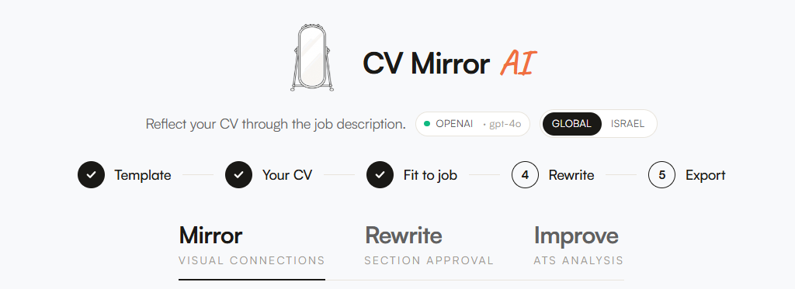
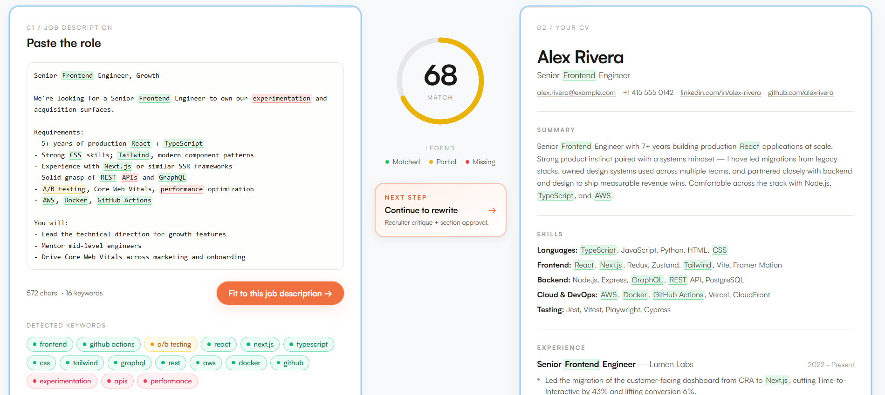
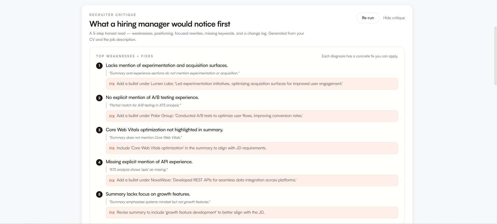
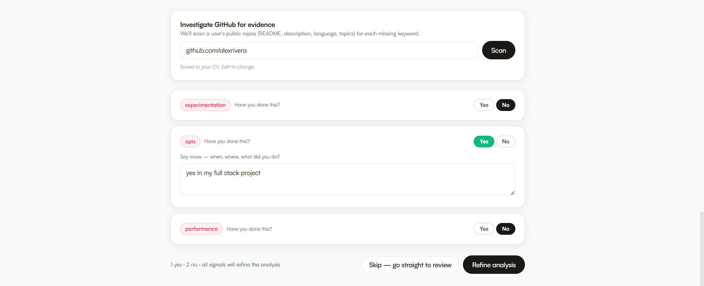
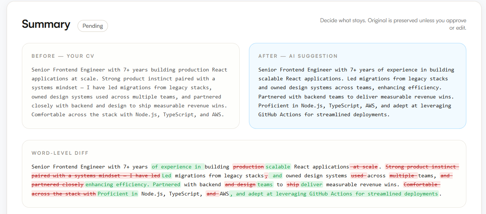
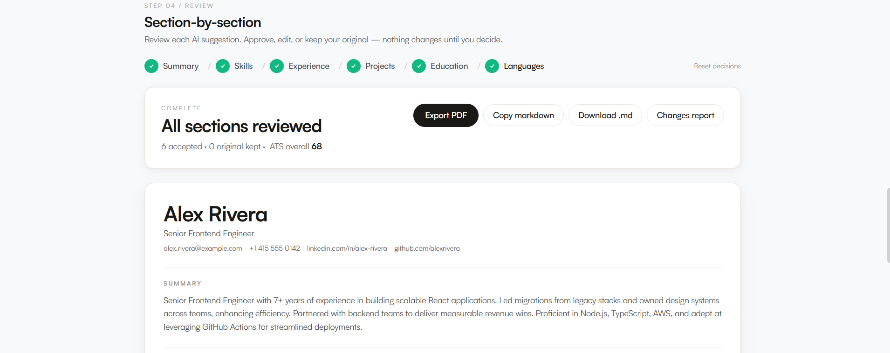

# CV Mirror AI

An editorial, side-by-side tool that "mirrors" your CV against a specific job
description. Paste a role, click one button, and watch the AI surface what
matches, what's missing, and where to push harder — with a recruiter-style
critique and a section-by-section approval wizard so nothing changes without
your say-so.

Built as a multi-user SaaS: pre-approved teammates sign in with Google or
email + password, each has their own private CV and analysis history, and
the admin controls who's in.

---

## What it looks like

### 1. Guided flow + identity



A horizontal **stepper** along the top frames the whole experience: pick a
template, upload your CV (or use the seed), paste a job description, run the
analysis, review, and export.

### 2. Mirror — analyze your CV against the JD



Pasted JD keywords are colored by status —
<span style="color:#10b981">**green** for matched</span>,
<span style="color:#f59e0b">**amber** for partial</span>,
<span style="color:#ef4444">**red** for missing</span> — and the same words
light up on the CV side. The CV panel's outline shifts from
<span style="color:#0099ff">**blue** (ready)</span> to the same green/amber/red
palette once the score is in, so the whole layout reads at a glance.

### 3. Recruiter critique — what a hiring manager would notice first



A five-panel strategic review at the top of the Rewrite step:

1. **Top weaknesses** — five concrete issues, each with a CV-quoted evidence
   line and a **fix** the user can apply directly.
2. **Positioning** — how the CV reads today vs how it should read for *this*
   role, plus the gap diagnosis.
3. **Improved sections** — the summary + 2–3 highest-leverage bullet
   rewrites, shown as before/after diffs.
4. **Missing keywords** — each with a natural-sounding suggestion line.
5. **Change log** — every proposed change with its rationale.

### 4. Missing-keyword Q&A — fill the gaps without inventing them



For each missing JD keyword the user can **mark Yes / No** and optionally
add context ("I built REST APIs at NovaWave in 2019"). A **GitHub
investigator** scans the user's public repos for evidence of the missing
skill, and any findings can be one-clicked into the explanation. On submit,
the analysis re-runs with all of it as context — Yes answers, No answers,
and GitHub evidence — so the AI weaves in only what's truthful.

### 5. Section-by-section rewrite — opt in to each change



For every section the AI proposes a rewrite, the user sees:

- **Before / After** with word-level diff
- **Changes** — concrete list of what's different
- **Reason** — why this version is stronger against the JD
- **Four actions**: Approve · Edit (inline editor pre-filled with the
  suggestion) · Keep original · Skip

The final tailored CV is **assembled client-side from the user's decisions**
— nothing is auto-applied.

### 6. Export — PDF in two templates, ATS-safe option



Two recreated-from-real-Canva templates (**Tech / Student** and
**Executive**) plus a parser-safe single-column ATS layout. A
**"Fit to one page"** toggle uses CSS `zoom` to uniformly shrink fonts +
spacing + headings until everything fits one A4 page. After download,
a follow-up CTA asks **"Fit to another job?"** — one click clears the JD
and bounces back to Mirror mode with the base CV intact.

---

## Architecture

```
cv-mirror/
├── client/                 React 18 + Vite + Tailwind + Zustand + Framer Motion
│   └── src/
│       ├── App.jsx                  AuthGate wraps everything; routes by status
│       ├── store/useAppStore.js     Zustand: auth, CV, JD, result, approvals,
│       │                            critique, mode, settings
│       ├── api/client.js            fetch wrappers (credentials: 'include')
│       └── components/
│           ├── auth/                LoginScreen · PendingApprovalScreen
│           │                        SettingsModal · AdminPanel · AuthGate
│           ├── layout/              TopBar · ModeSwitcher · FlowStepper
│           ├── mirror/              MirrorView · JD input · CV panel
│           │                        ScoreCircle · KeywordChip · Legend
│           ├── rewrite/             SectionReviewWizard · RecruiterCritique
│           │                        MissingKeywordsQA · DiffView
│           │                        InlineEditor · ReviewSummary
│           ├── improve/             ATSReportView · GithubHealthCard
│           ├── editor/              BaseCVEditor · CVUpload · SectionedCVEditor
│           ├── export/              PDFPreviewModal · TemplatePicker
│           └── onboarding/          WelcomeFlow
│
├── server/                 Node 20 + Express + Passport + SQLite (better-sqlite3)
│   ├── server.js                    Express boot; session + passport;
│   │                                serves client/dist in production
│   ├── db/init.js                   SQLite schema + idempotent migrations
│   ├── middleware/auth.js           requireAuth · requireApproved · requireAdmin
│   ├── routes/
│   │   ├── authRoutes.js            Google OAuth + email/password + dev-signin
│   │   ├── adminRoutes.js           User approve/revoke + preapproved-emails
│   │   ├── settingsRoutes.js        Per-user template / market / onboarding
│   │   ├── cvRoutes.js              GET/PUT CV · POST upload (PDF/DOCX)
│   │   ├── analysisRoutes.js        POST /analyze · /critique · github-*
│   │   └── exportRoutes.js          POST /pdf · /markdown · /plaintext
│   ├── services/
│   │   ├── aiService.js             Provider abstraction (mock | openai)
│   │   │                            SYSTEM_TAILOR + SYSTEM_RECRUITER_CRITIQUE
│   │   ├── mockAI.js                Deterministic mock for offline / no-key
│   │   ├── userStore.js             Per-user DB layer (CVs, results, settings,
│   │   │                            password hashes, preapproved emails)
│   │   ├── cryptoStore.js           AES-256-GCM for keys at rest
│   │   ├── keywordService.js        JD keyword extraction + match scoring
│   │   ├── atsService.js            ATS-style sub-scores + warnings
│   │   ├── extractionService.js     PDF (pdfjs) + DOCX (mammoth) → CV JSON
│   │   ├── pdfService.js            Puppeteer + Handlebars render with
│   │   │                            one-page CSS-zoom binary search
│   │   ├── githubService.js         Public repos → keyword evidence
│   │   ├── fileStorageService.js    Atomic JSON read/write
│   │   └── seed.js                  Default starter CV
│   ├── templates/                   Handlebars + CSS — three exportable layouts
│   │   ├── template-modern.{html,css}    Left-sidebar with icons
│   │   ├── template-classic.{html,css}   Right-sidebar, monochrome
│   │   └── template-ats-safe.{html,css}  Single-column, parser-safe
│   └── data/                        (gitignored) SQLite + sessions DB
│
├── Dockerfile              Multi-stage build, system Chromium, tini PID-1
├── fly.toml                Fly.io app config (1GB VM, persistent volume)
├── DEPLOY.md               Full deploy walkthrough (Fly.io + Google OAuth)
└── docs/GOOGLE_OAUTH.md    Google Cloud Console setup, step by step
```

**Data flow at a glance:**

```
User signs in (Google or email/password)
      ↓ session cookie (SQLite-backed)
       Per-user CV  +  Per-user analysis result  (SQLite, /data volume)
      ↓
JD pasted → keywordService extracts → categorizeMatches against CV
      ↓
aiService.tailor() → mock OR OpenAI gpt-4o
   (rules: no fabrication, preserve matched keywords, STAR bullets)
      ↓
Client renders Mirror; user runs critique + Q&A; refine call back to /analyze
      ↓
User opts in to each section's rewrite → tailored CV assembled in browser
      ↓
exportRoutes → Puppeteer renders Handlebars template → PDF download
```

**Auth gates** (defined in [`server/middleware/auth.js`](server/middleware/auth.js)):

- `requireAuth` — session exists.
- `requireApproved` — session AND `is_approved = 1` in the DB.
- `requireAdmin` — session AND `is_admin = 1`.

`ADMIN_EMAIL` from env is auto-promoted on first sign-in. Pre-approved
emails (managed via the admin panel) skip the waiting room. All other
sign-ins land on `PendingApprovalScreen` until the admin approves them.

---

## Running locally

### Prerequisites

- **Node 20+** (Node 18 works but 20 is what production runs on)
- A modern browser
- (Optional) An OpenAI API key — the app works in `mock` mode without one

### One-time setup

```bash
git clone https://github.com/<you>/cv-mirror.git
cd cv-mirror

npm install              # root-level dev orchestrator (concurrently)
npm install --prefix server
npm install --prefix client
```

> First `server` install pulls a few native modules (`better-sqlite3`,
> `puppeteer` with its bundled Chromium). On Windows this can take ~5 min.

### Configure `server/.env`

Copy the template:

```bash
cp server/.env.example server/.env
```

Open `server/.env` and fill in:

```bash
# AI provider — start with 'mock' to test the UI without a key
AI_PROVIDER=mock
# When ready for real tailoring:
# AI_PROVIDER=openai
# OPENAI_API_KEY=sk-...
# OPENAI_MODEL=gpt-4o

# Auth — 'dev' lets you sign in with any email locally (no password)
AUTH_PROVIDER=dev
# Or switch to 'google' for real OAuth — see docs/GOOGLE_OAUTH.md

# Auto-promote yourself to admin on first sign-in
ADMIN_EMAIL=you@example.com

# Required: long random strings (≥ 32 chars each)
# Generate with: node -e "console.log(require('crypto').randomBytes(32).toString('hex'))"
SESSION_SECRET=<paste 32+ random hex chars>
CRYPTO_SECRET=<paste 32+ random hex chars>
```

### Start the dev servers

```bash
npm run dev
```

From the repo root, this starts both:

- **Server** at `http://localhost:4000` (Express API)
- **Client** at `http://localhost:5173` (Vite dev server, proxies `/api` → 4000)

Open `http://localhost:5173`. Sign in with the email you set as
`ADMIN_EMAIL` — you'll be auto-approved and land in the app.

### Day-to-day commands

| Command | What it does |
|---|---|
| `npm run dev` | Start both servers with auto-reload |
| `npm run dev --prefix server` | Server only (port 4000) |
| `npm run dev --prefix client` | Client only (port 5173) |
| `npm run build --prefix client` | Build the SPA to `client/dist/` |
| `node --check server/server.js` | Quick syntax check |

### Toggles worth knowing

- **Mock vs real AI** — flip `AI_PROVIDER=mock` ↔ `openai` in `server/.env`,
  then restart the server. Mock returns deterministic, sensible tailoring
  so the whole UI is exercisable without a key.
- **Auth modes** — `dev` (email-only, no password), or `google` (real
  OAuth — see [docs/GOOGLE_OAUTH.md](docs/GOOGLE_OAUTH.md) to set up). Email
  + password is always available in either mode (gated by the admin's
  preapproved-emails list).
- **Target market** — switches in the TopBar between **Global** and
  **Israel**. The Israeli mode applies localized norms (Hebrew name
  detection, 1-page default, military service block, omit high school,
  etc.) across both the editor and the AI prompts.

---

## How tailoring stays honest

- Both the mock and the OpenAI prompt **forbid inventing** experience,
  dates, employers, schools, skills, or projects.
- Tailoring only **rewrites, reorders, or emphasizes** content that
  already exists in the user's CV.
- A JD keyword may be added **only** if it's already implicitly
  demonstrated by an existing bullet — or if the user provides explicit
  context for it in the Missing-Keywords Q&A.
- Education and Languages are **never modified** — they're factual.
- A "user said no" answer **always wins** over any other signal, including
  matching GitHub evidence.
- Matched keywords already present in the source CV must remain in any
  rewritten section (compression removes filler, not signal).
- Every change is opt-in via the approval wizard; nothing is applied
  automatically.

---

## Deploying

See [DEPLOY.md](DEPLOY.md) for the full walkthrough to host this on Fly.io
